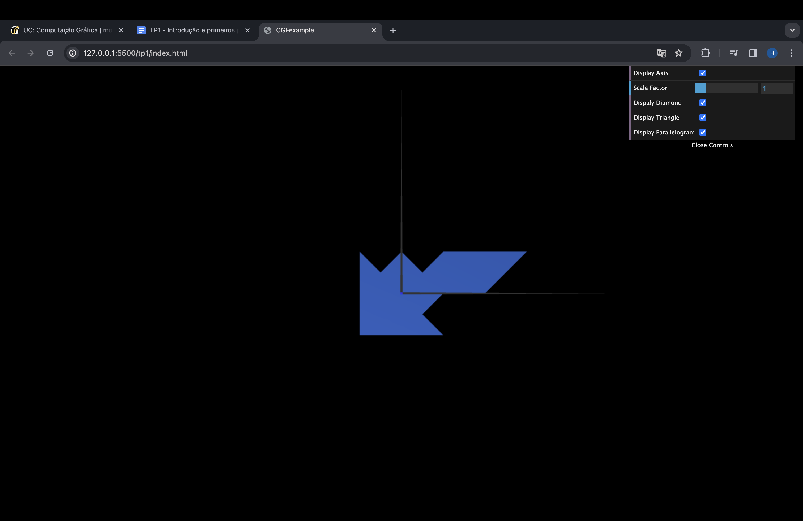

# CG 2023/2024

## Group T0xG0y

## TP 1 Notes

exercicio 1 
dificuldades: perceber como meter a referencia dos vetores (indices)
observações: observamos o resultado esperado

exercicio 2
observações: observamos o resultado esperado

