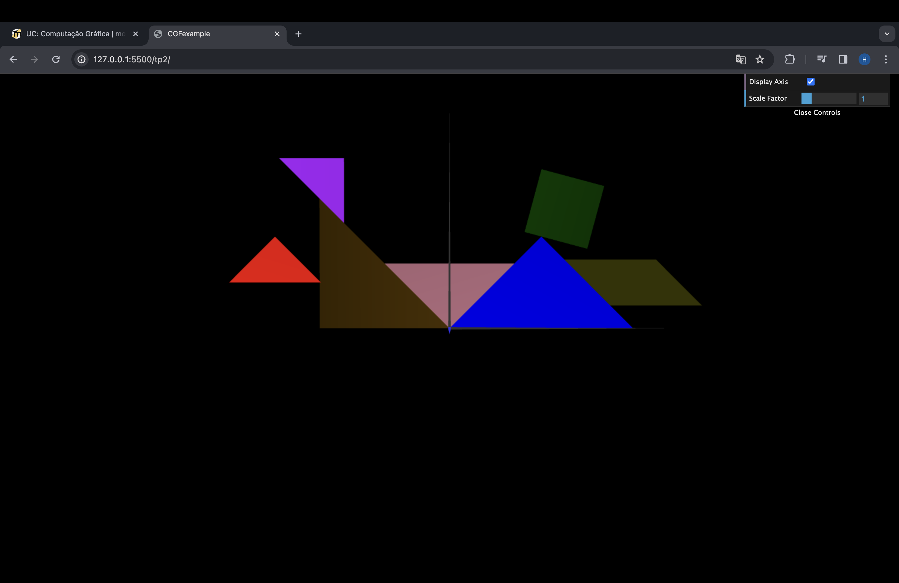
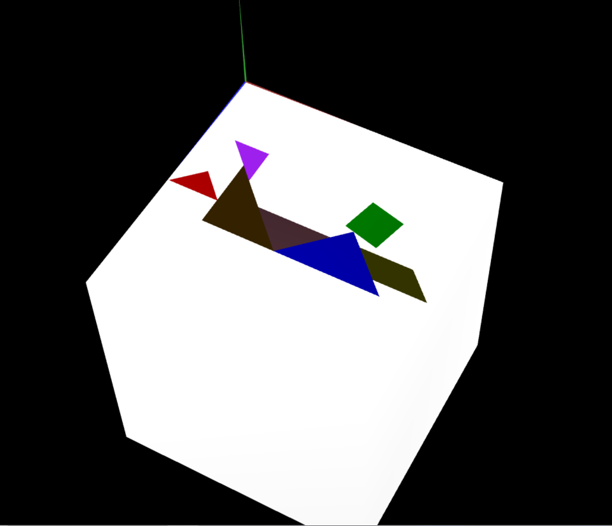
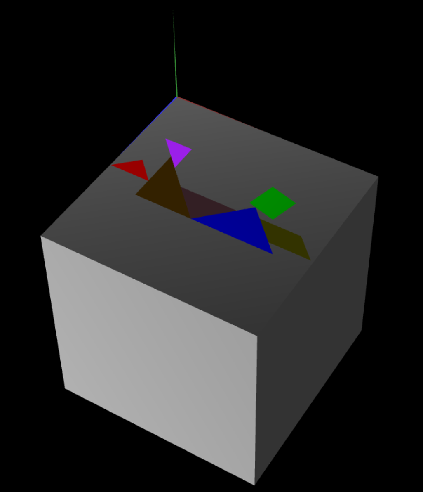

# CG 2023/2024

## Group T11G01

## TP 2 Notes

### Exercicio 1 
- Dificuldades: Perceber como utilizar a matriz para aplicar o escalamento, a rotação e a translação de objetos. Tivemos ainda alguma dificuldade em organizar as peças.
- Observações: O tangram foi replicado com sucesso aplicando transformações geométricas.

### Exercicio 2 
- Dificuldades: Visualizar em 3D os vertices para os indices dos triangulos.
- Observações: Pelo que comprendemos no enunciado colocamos corretamente as duas figuras embora por não se estar a analisar as sombras ainda há alguma dificuldade em compreender o cubo em 3D.

### Exercicio 3
- Dificuldades: Dificuldade na ordem das transformações geométricas. 
- Observações: Verificamos que a iluminação é diferente, uma vez que o cubo é composto por vários "objetos".

