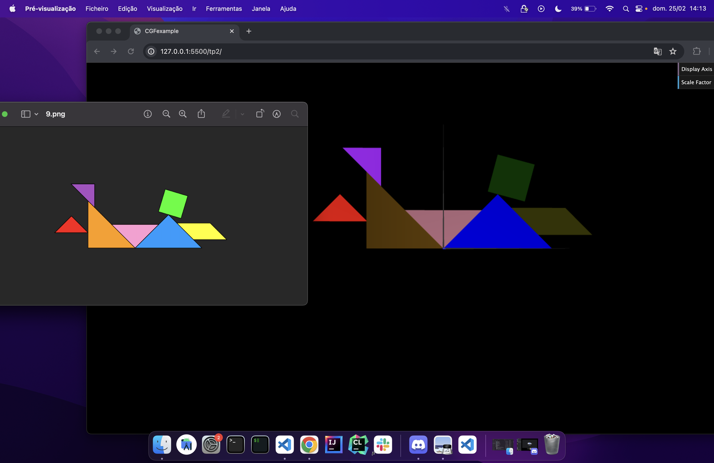

# CG 2023/2024

## Group T11G01

## TP 1 Notes

### Exercicio 1 
- Dificuldades: Perceber como utilizar a matriz para aplicar o escalamento, a rotação e a translação de objetos. Tivemos ainda alguma dificuldade em organizar as peças.
- Observações: O tangram foi replicado com sucesso aplicando transformações geométricas.

