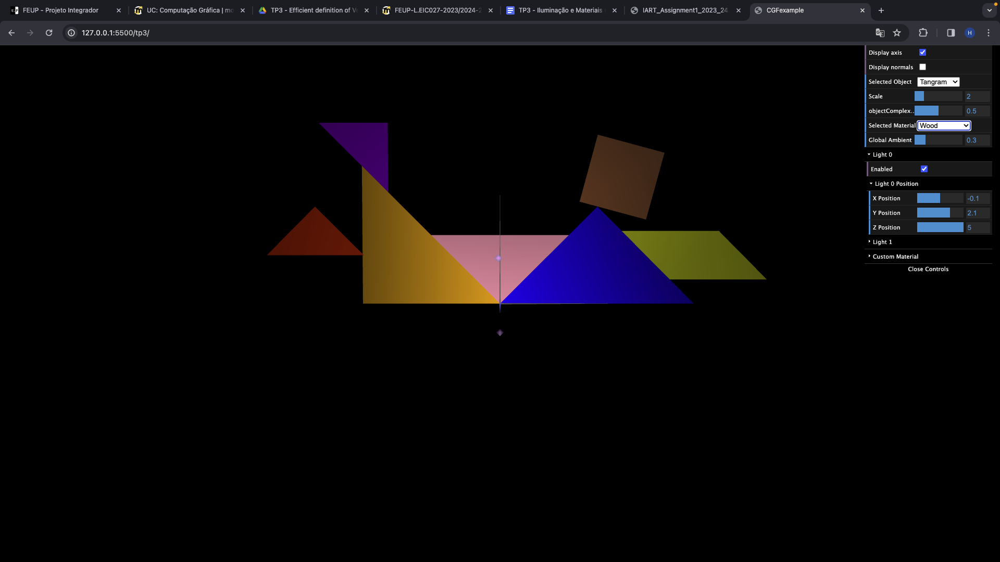

# CG 2023/2024

## Group T11G01

## TP 3 Notes

### Exercicio 1 
- Dificuldades: Apresentar as normais do tangram pois esse requeria um override nas funções enableNormalViz() e disableNormalViz() e um erro na matriz da tranformação do diamante que deixava as normais a um angulo
- Observações: Criamos então o material de madeira e demos alguma reflexão ao tangrama

