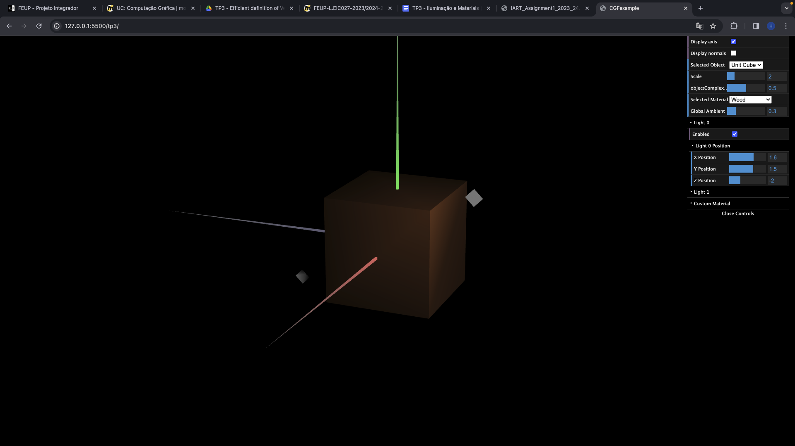
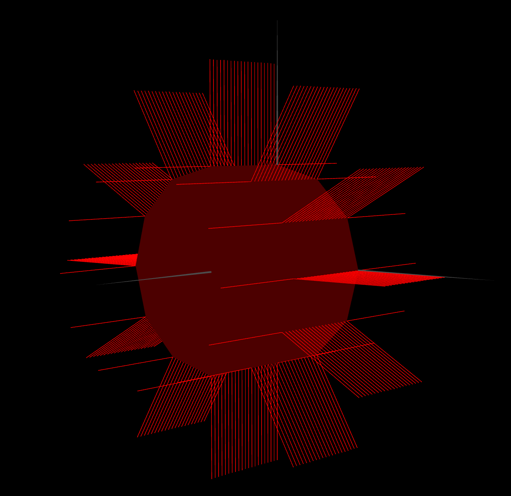

# CG 2023/2024

## Group T11G01

## TP 3 Notes

### Exercicio 1 
- Dificuldades: Apresentar as normais do tangram pois esse requeria um override nas funções enableNormalViz() e disableNormalViz() e um erro na matriz da tranformação do diamante que deixava as normais a um angulo
- Observações: Criamos então o material de madeira e demos alguma reflexão ao tangrama

### Exercicio 2
- Dificuldades: Escrever o loop dos vertices e indexes no prisma, e mais tarde acabar as bases
- Observações: O prisma foi de facto criado com sucesso sem as bases como sugerido e notou-se a questão de a iluminação se aproximar a um constant shading dado que cada lado tem as mesmas normais em cada ponto mas diferentes entre si logo a iluminação vai ser constante num lado inteiro mas muda quando passa para outro lado

### Exercicio 3
- Dificuldades: O loop foi ainda mais complicado desta vez por causa de ter de colocar muitos menos vertices
- Observações: Observamos que como esperado a iluminação apresenta uma iluminação mais suavizada dando o aspeto de ser curvo por causa de nas arestas não ser uma mudança instantanea de normais que causaria uma iluminação constante em cada face mas diferente entre elas (o prisma)

