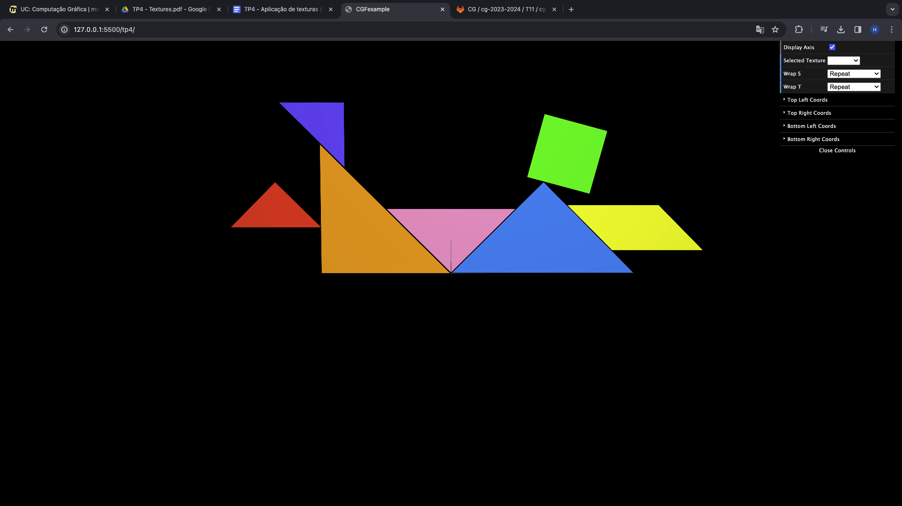
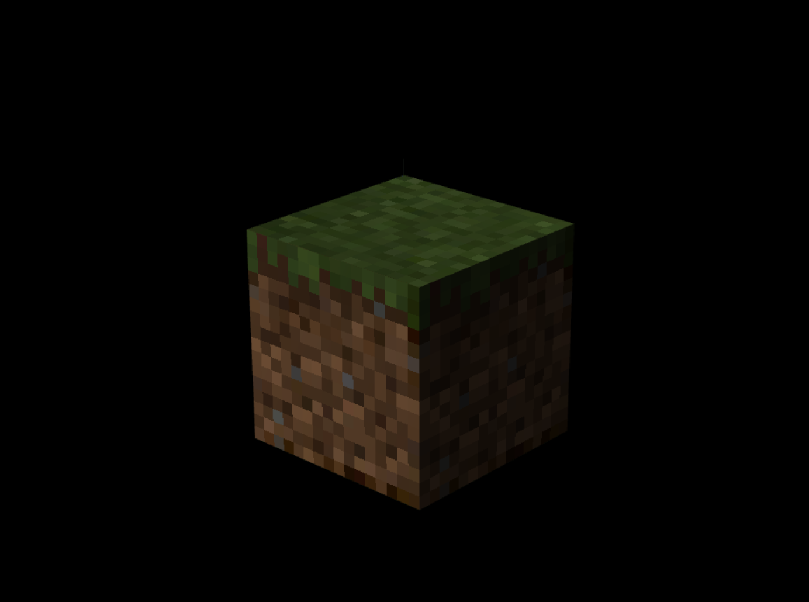

# CG 2023/2024

## Group T11G01

## TP 4 Notes

### Exercicio 1.1 - 1.3 
- Dificuldades: Perceber como estrutrar o código e como corresponder os vértices dos objetos com os vérticos do ficheiro tangram.png.
- Observações: Tal como pedido, todas as peças do tangram têm a sua textura.

### Exercicio 1.4 - 1.7
- Dificuldades: Reorganizar as coordenadas da texturas dos lados e retirar o filtering
- Observações: Tal como pedido, cubo de minecraft com as texturas não filtradas

