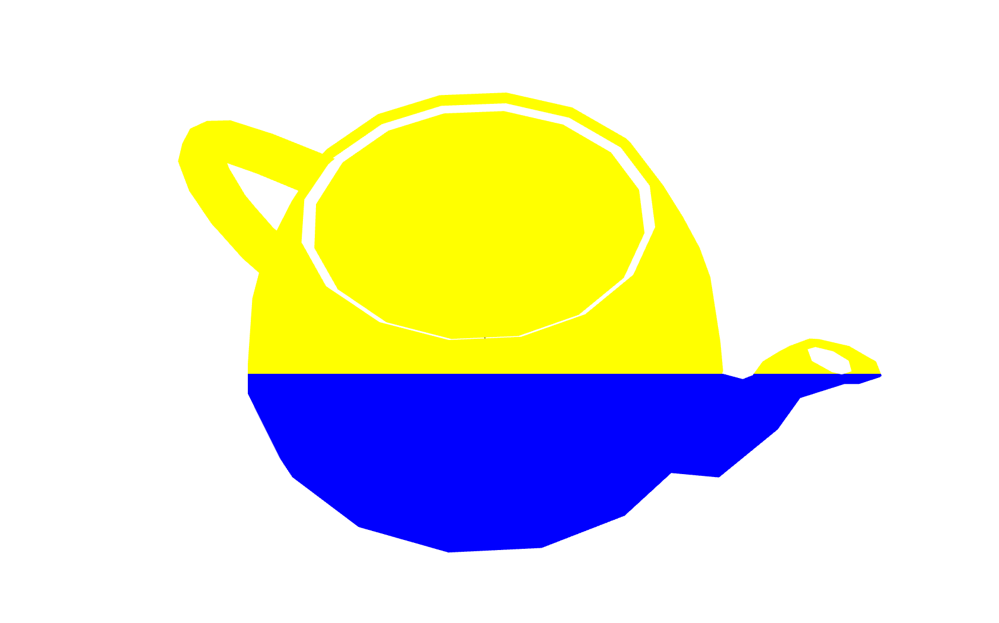
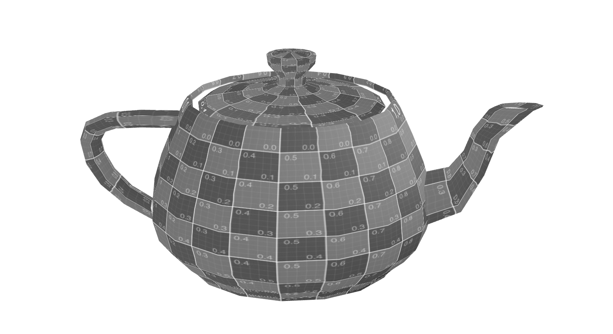
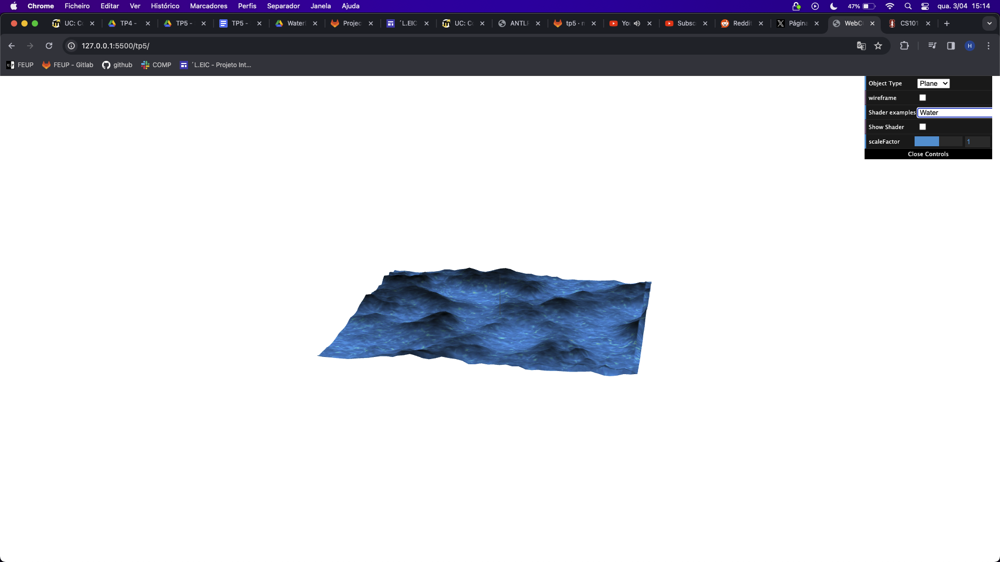

# CG 2023/2024

## Group T11G01

## TP 5 Notes

### Exercicio 1
- Dificuldades: Criar e utilizar shaders.
- Observações: Observou-se o resultado esperado.

### Exercicio 2
- Dificuldades: Colocar as sombras na água e descobrir que valores colocar para dar um efeito realista.
- Observações: A água move-se tal como pedido.

